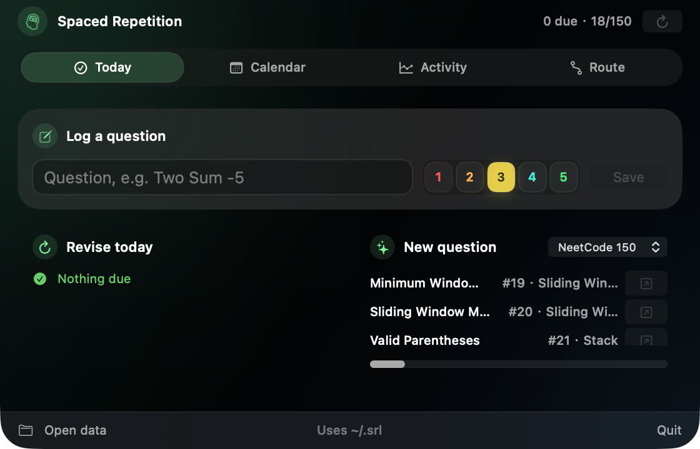
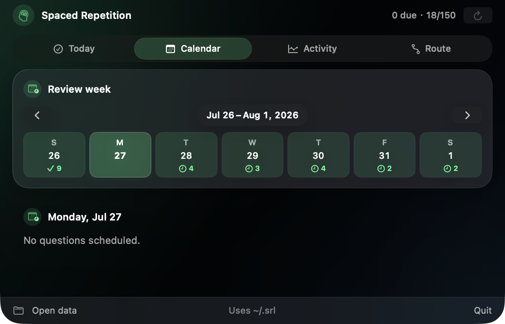
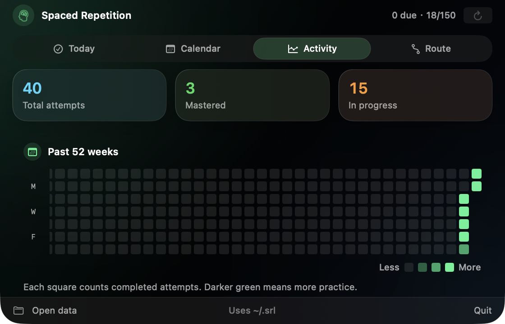
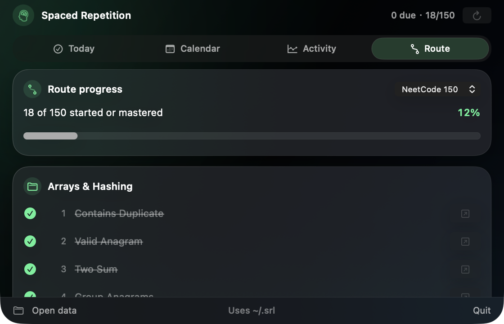

# Spaced Repetition Learning for macOS

A native SwiftUI study companion that expands from the MacBook notch and shares data with the `srl` CLI.

<p align="center">
  
  
</p>
<p align="center">
  
  
</p>

## Features

- Hover-to-open notch interface with Liquid Glass styling.
- Log ratings from 1–5 with Tab autocomplete or `Two Sum -5` shorthand.
- Today, weekly calendar, activity, and route views.
- Blind 75, NeetCode 150, and NeetCode 250 study routes.

## Run

Requires macOS 13+ and Swift 6+.

```bash
git clone https://github.com/harrycodingnow/spaced-repetition-learning-mac-app.git
cd spaced-repetition-learning-mac-app
./macos/SRLMenuBar/scripts/build-app.sh
open "macos/SRLMenuBar/dist/SRL Menu Bar.app"
```

The app reads and writes the existing `~/.srl` data directory. See [macOS development notes](macos/SRLMenuBar/README.md) for details.

Forked from [HayesBarber/spaced-repetition-learning](https://github.com/HayesBarber/spaced-repetition-learning) and released under the [MIT License](LICENSE).
